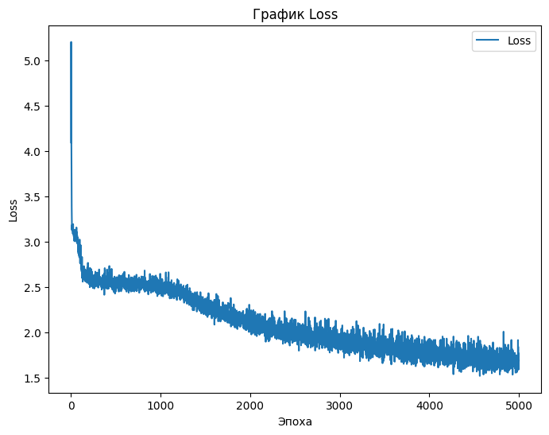

# RWKV-implementation

## [Ссылка на статью](https://arxiv.org/pdf/2305.13048)

## [Вспомогательные материалы](https://github.com/BlinkDL/RWKV-LM)

### Особенности архитектуры RWKV

**Основной тезис:** RWKV, сочетая в себе выразительные качества трансформеров, включая параллельное обучение и надежную масштабируемость, с преимуществами RNN, такими как обработка длинных последовательностей, обходит проблемы с памятью и квадратичным масштабированием, которые свойственны трансформерам, благодаря эффективному линейному масштабированию.

Один слой RWKV состоит из двух блоков - **Time Mixing** и **Channel Mixing**, между которыми применяется LayerNorm, а также **результат выполнения каждого из блоков складывается с тем, что было подано в блок на вход.**

В **Time Mixing** есть три матрицы - Receptance, Key, Value. К Key и Value применяется взвешенное внимание WKV (внимание - элеменнт трансмформерной архитектуры), далее которое перемножается с Sigmoid(Receptance) (что есть элементом реккурентной сети, например блока LSTM или GRU).

В **Channel Mixing** матрицы K’ и V' используется для вычисления весов внимания, которые затем применяются к матрице R’. Это делается путем вычисления скалярного произведения между K’ и R’.

После N слоёв применяется LayerNorm, Softmax для получения вероятностей следующего токена.

Формула взвешенного внимания WKV


### Постановка задачи

1) Имплементировать архитектуру RWKV
2) Выбрать трансформер, с результатом которого будем сравнивать результаты RWKV
3) Подобрать параметры (размер пространства эмбеддингов, количество слоёв, голов), чтобы размеры моделей получились близкими друг к другу и были максимальными, которые только мы можем реализовать в рамках наших вычислительных ресурсов (nvidia-4070 12gb, nvidia Tesla T4 16gb), чтобы приблизиться к реальным LLM-моделям.
4) Подобрать датасет
5) Обучить обе модели на выбранном датасете
6) Сравнить получившиеся результаты, сделать выводы

### Сбор данных (датасет)

В качестве датасета рассмотрели несколько готовых:

#### RefinedWeb

#### + Плюсы

- Разнообразие данных
- Количество данных

#### - Минусы

- Много не связанного текста и сторонних символов, что не позволило нормально обучить модель
- Размер датасета (нам не хватило ресурсов kaffle для обучения GPT2 размером более 100M на кагле)
- После 5к итераций получили генератор рандомных букв

https://huggingface.co/datasets/tiiuae/falcon-refinedweb

#### Wikipedia

Набор данных Википедии включает очищенные статьи с разных языков. Полученные из дампов Википедии, каждый язык имеет отдельное разделение. Статьи предварительно обрабатываются, удаляются уценки и ненужные разделы, а также анализируются с помощью инструмента mwparserfromhell. Этот набор данных позволяет моделировать язык и предлагает подмножества для каждого языка и даты.

#### + Плюсы

- большая длина каждого семпла
- получили результат лучше чем на RefinedWeb после 5000 итераций

#### - Минусы

- пришлось убрать специальные символы, чтобы обучать модели
- не смогли использовать весь датасет (на 10 000 семплах) модель обучалась в течении часа, что не позволяла итеративно подбирать параметры для модели

https://huggingface.co/datasets/wikipedia  

### Результаты GPT-2

В качестве модели, с которой сравнивались результаты обучения RWKV, была выбрана GPT-2 с 85 миллионами параметров.

В результате обучения на датасете за 5000 итераций модель научилась генерировать тексты следующего формата:

```plaintext
Soviet Union. The made also a tember helping size Didle Churcreas Britains Ny Moster. Lister Lind Mininin when she name Europe were to the sarviving was to in New was the prequence in  South object as as and the meditial hable neaternated story become of the is intern on the motal landesign into attriography oxilem.
Lover Ovenn her espell staid Vectorient It. In , Manultine happerble the history in Acudied at the that cell in the condicities diplace. Unted Senastitutions relied Cander with exitiventting wit
```



### Результаты RWKV

Количество параметров сети RWKV составило 90 миллионов:
В результате обучения на датасете за 5000 итераций модель научилась генерировать тексты следующего формата:  

``` plaintext
Soviet Union complicated on Coperatorists trapping a glade game creator.
Moguese Tulky Rock
Management and residential USArgentinas increasing or DWP control on the , mostly dR revolved around  million to  companies. History under tailway with previously. Additionally, geologists but not vocated, units concluded a master in  children into discanneWoak for correlative luke, smowtheud zone.
Feminical moments are known in New Yorks hand, and who first away after the An champion, Padria Arami, and
```

Графики на train и validation в процессе обучения


### Результат работы / вывод

...

### Команда и распределение задач

- **Мария Ульянова, Артем Цыканов**
  - имплементация архитектуры RWKV
  - подбор параметров моделей
  - обучеие RWKV

- **Евгений Гуров, Егор Тарасов**
  - сборка и подготовка датасета
  - обучение GPT-2
  - оформление результатов
