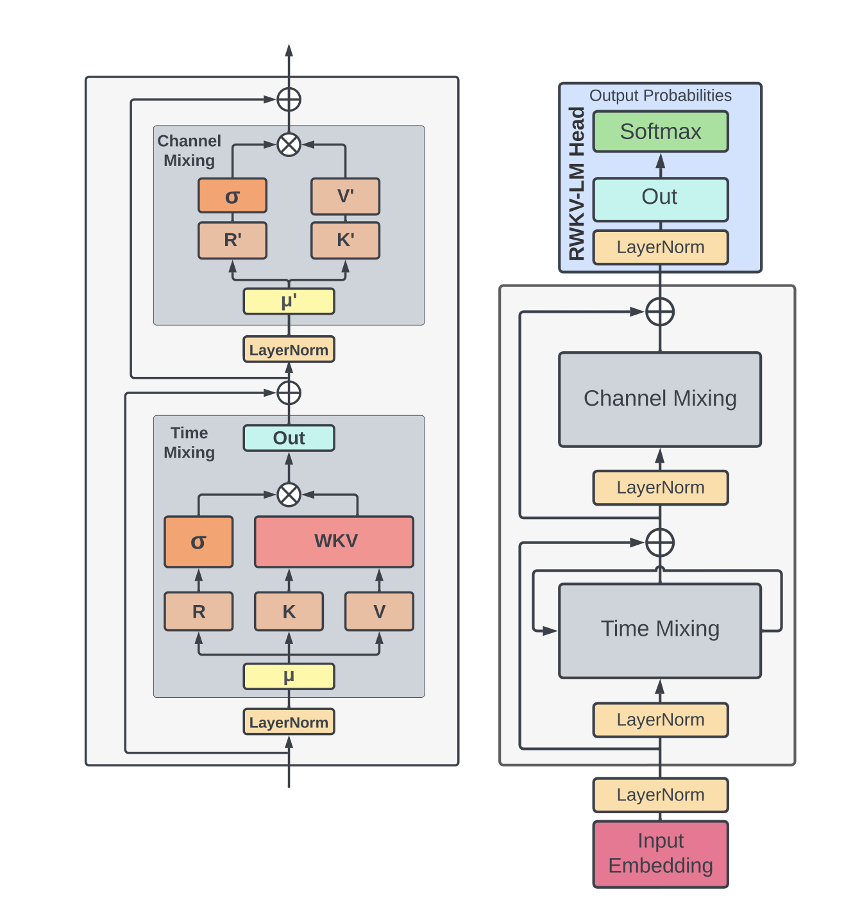
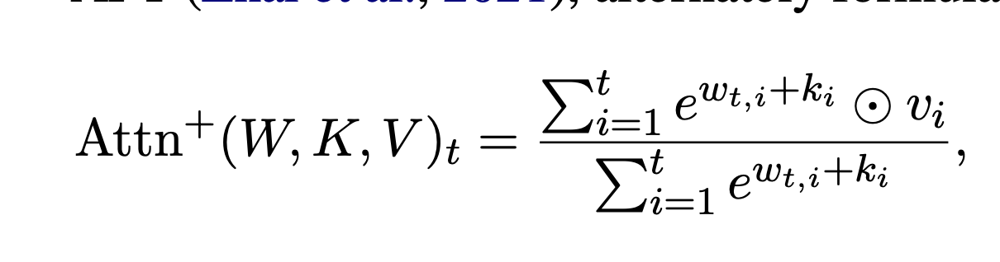
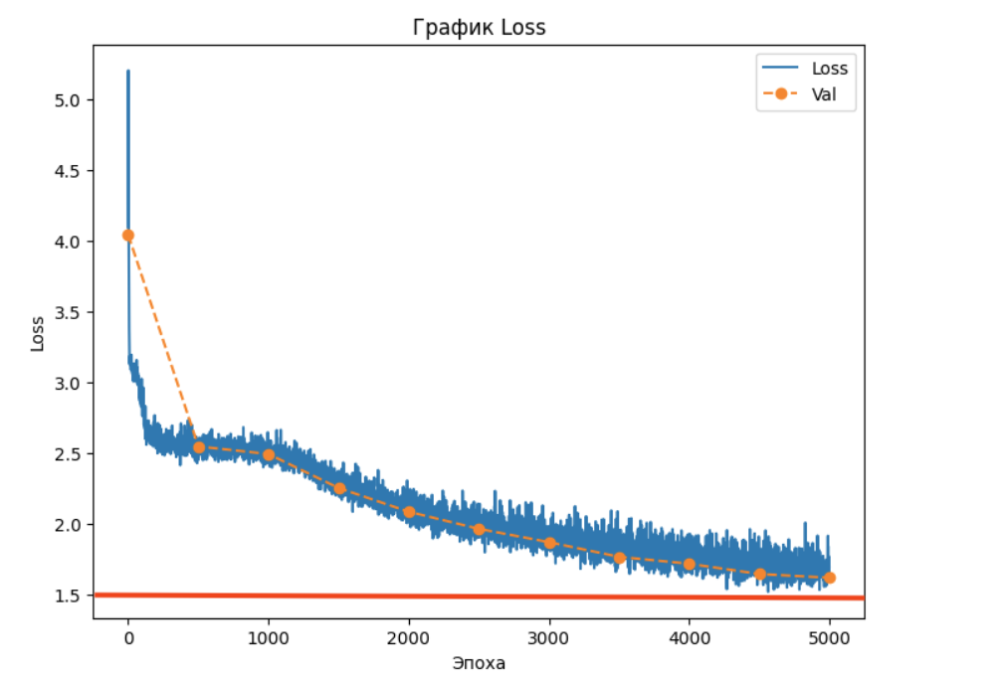
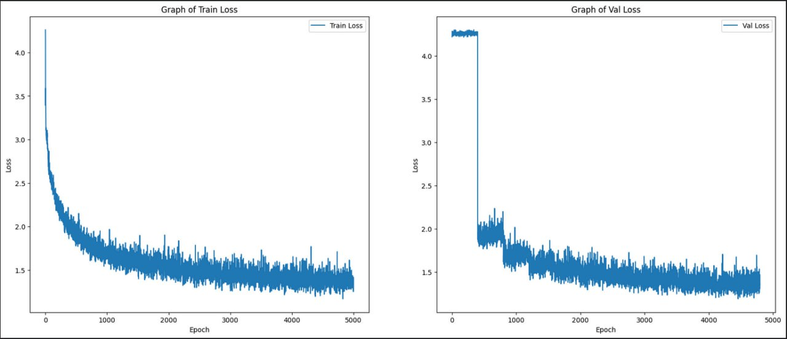

# RWKV-implementation

## [Ссылка на статью](https://arxiv.org/pdf/2305.13048)

## [Вспомогательные материалы](https://github.com/BlinkDL/RWKV-LM)

### Особенности архитектуры RWKV

**Схема архитектуры:**




**Основной тезис:** RWKV, сочетая в себе выразительные качества трансформеров (параллельное обучение и надежная масштабируемость) и преимущества RNN (обработка длинных последовательностей), обходит проблемы с памятью и квадратичным масштабированием, которые свойственны трансформерам, благодаря эффективному линейному масштабированию.

Один слой RWKV состоит из двух блоков - **Time Mixing** и **Channel Mixing**, между которыми применяется LayerNorm, а также **результат выполнения каждого из блоков складывается с тем, что было подано в блок на вход.**

В **Time Mixing** представлена изначально заданная с помощью экспоненциального затухания и неизменяемая матрица весов. Этот блок направлен на моделирование исторических данных и выявление временных зависимостей. Происходит учёт предыдущих состояний для расчёта последующего. Здесь применяется **WKV Attention**. 

Блок **Channel Mixing** содержит обучаемую матрицу весов, представленную линейным слоем. Это позволяет извлекать верхнеуровневые признаки и смешивать информацию между каналами, не делая акцент на временной зависимости.

После N слоёв применяется LayerNorm, Softmax для получения вероятностей следующего токена.

Формула взвешенного внимания WKV:




### Постановка задачи

1) Имплементировать архитектуру RWKV
2) Выбрать трансформер, с результатом которого будем сравнивать результаты RWKV
3) Подобрать параметры (размер пространства эмбеддингов, количество слоёв, голов), чтобы размеры моделей получились близкими друг к другу и были максимальными, которые только мы можем реализовать в рамках наших вычислительных ресурсов (nvidia-4070 12gb, nvidia Tesla T4 16gb), чтобы приблизиться к реальным LLM-моделям.
4) Подобрать датасет
5) Обучить обе модели на выбранном датасете
6) Сравнить получившиеся результаты, сделать выводы


### Сбор данных (датасет)

В качестве обучающего датасета рассмотрели несколько готовых:

#### RefinedWeb


#### + Плюсы

- Разнообразие данных
- Количество данных

#### - Минусы

- Много несвязного текста и сторонних символов, что не позволило нормально обучить модель
- Размер датасета (нам не хватило ресурсов kaggle для обучения GPT2 размером более 100M)
- После 5к итераций получили генератор рандомных букв

https://huggingface.co/datasets/tiiuae/falcon-refinedweb

#### Wikipedia

Набор данных Википедии включает очищенные статьи на разных языках. Мы взяли английский язык для наглядной интерпретации результатов. Статьи предварительно обрабатываются, удаляются ненужные разделы, а также анализируются с помощью инструмента mwparserfromhell. 

#### + Плюсы

- большая длина каждого семпла
- получили результат лучше, чем на RefinedWeb, после 5000 итераций

#### - Минусы

- пришлось убрать специальные символы, чтобы обучать модели
- не смогли использовать весь датасет из-за ограниченных ресурсов по памяти

**Итого, в обучающей выборке было 10000 текстов из Википедии, суммарно - 213 миллиона символов**

https://huggingface.co/datasets/wikipedia 


### Результаты GPT-2

В качестве модели, с которой сравнивались результаты обучения RWKV, была выбрана GPT-2 с 85 миллионами параметров.

Код обучения модели представлен в [файле](gpt2-small-notebook.ipynb).

В результате обучения на датасете за 5000 итераций модель научилась генерировать тексты следующего формата:

```plaintext
Soviet Union. The made also a tember helping size Didle Churcreas Britains Ny Moster. Lister Lind Mininin when she name Europe were to the sarviving was to in New was the prequence in  South object as as and the meditial hable neaternated story become of the is intern on the motal landesign into attriography oxilem.
Lover Ovenn her espell staid Vectorient It. In , Manultine happerble the history in Acudied at the that cell in the condicities diplace. Unted Senastitutions relied Cander with exitiventting wit
```

График на train и validation в процессе обучения



### Результаты RWKV

Количество параметров сети RWKV составило 90 миллионов:

Код обучения модели представлен в [файле](rwkv-90m-1.ipynb).

В результате обучения на датасете за 5000 итераций модель научилась генерировать тексты следующего формата:  

``` plaintext
Soviet Union complicated on Coperatorists trapping a glade game creator.
Moguese Tulky Rock
Management and residential USArgentinas increasing or DWP control on the , mostly dR revolved around  million to  companies. History under tailway with previously. Additionally, geologists but not vocated, units concluded a master in  children into discanneWoak for correlative luke, smowtheud zone.
Feminical moments are known in New Yorks hand, and who first away after the An champion, Padria Arami, and
```

Графики на train и validation в процессе обучения



### Результат работы / вывод

В итоге получилось, что:

- из представленных графиков выше видно, что loss и на трейне, и на валидации у RWKV получились ниже, чем у GPT-2. GPT-2 доходит до отметки в 1.5, RWKV уже с 1000 итераций обучения становится ниже, чем 1.5, практически на 0.5
- архитектура RWKV включает в себя функцию активации, которая обозначена на схеме µ. как удалось выяснить в процессе исследования, имелась в виду произвольная функция активации. нами были протестированы варианты с ReLU и SiLU. SiLU показала себя лучше
- RWKV в среднем обучалась немного быстрее GPT-2, но разница почти не значительна
- RWKV после обучения лучше улавливлает контекст и генерирует более связные предложения
- начали работу с моделей меньших размеров (14 миллионов параметров) и увеличивали их число, пока не встали в лимиты по железу (дошли до 90 миллионов)
- в остальных .ipynb файлах представлены варианты и конфигурации моделей и датасетов, которые были получены в процессе работы


### Команда и распределение задач

- **Мария Ульянова, Артем Цыканов**
  - имплементация архитектуры RWKV
  - подбор параметров моделей
  - обучение RWKV

- **Евгений Гуров, Егор Тарасов**
  - сборка и подготовка датасета
  - обучение GPT-2
  - оформление результатов
